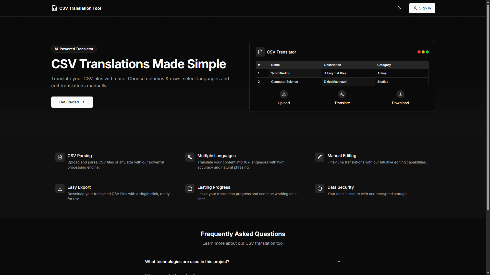
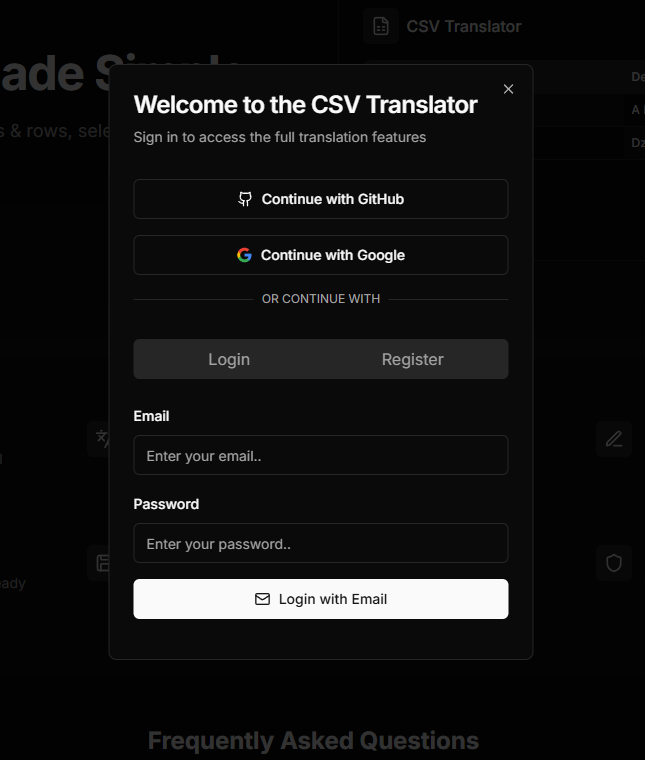
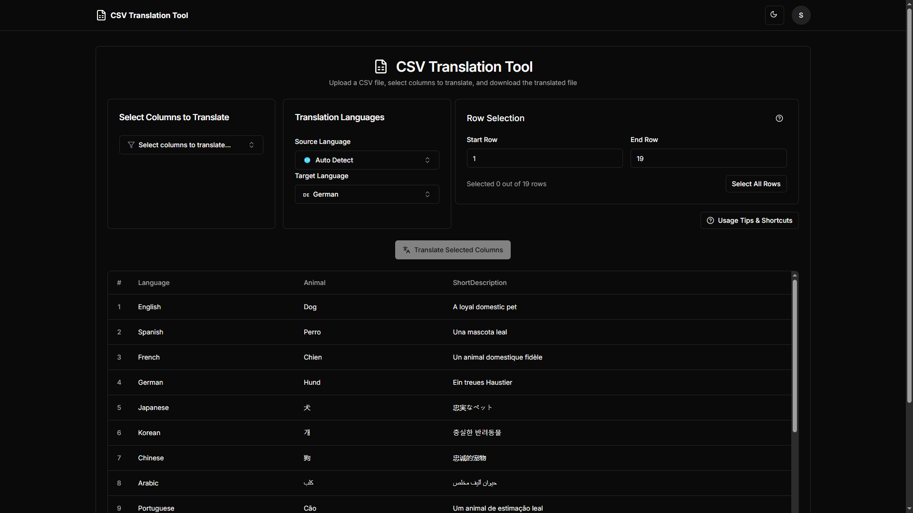
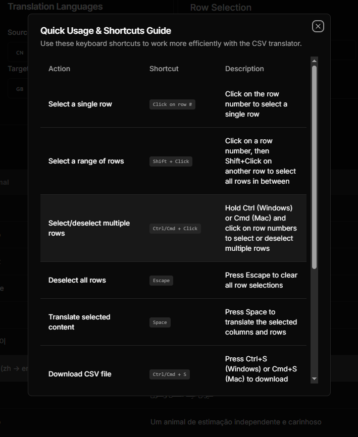
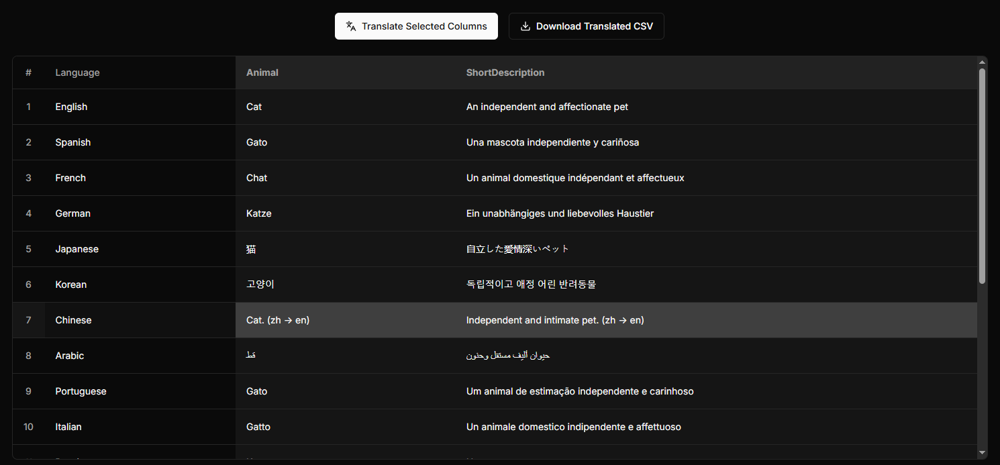

# 🌍 Semi-Automatic AI-Powered CSV Translation Tool

A **web-based platform** for **semi-automatic CSV translation** powered by **AI (MarianMT)** and enhanced with **human validation**.

[](LICENSE)

---

## 📑 Table of Contents

* [Features](#features)
* [Screenshots](#screenshots)
* [Tech Stack](#tech-stack)
* [Architecture](#architecture)
* [Quick Start](#quick-start)
* [Documentation](#documentation)
* [Linting & Formatting](#linting--formatting)
* [Testing](#testing)
* [Contact](#contact)

---

<a name="features"></a>

## ✨ Features

| Category                 | Description                                                                 |
| ------------------------ | --------------------------------------------------------------------------- |
| **📁 File Handling**     | Upload CSV files, select rows/columns, validate content                     |
| **🤖 Smart Translation** | AI-based translation (MarianMT via Rust), error highlighting, Redis caching |
| **🔐 Authentication**    | JWT/OAuth2 login, MongoDB-based session persistence                         |
| **⬇️ Export**            | Download translated CSV files                                               |

---

<a name="screenshots"></a>

## 🖼️ Screenshots

<p align="center">
  <br/>
  <em>Home Page</em>
</p>

<p align="center">
  <br/>
  <em>Sign Dialog</em>
</p>

<p align="center">
  <br/>
  <em>Dashboard Page</em>
</p>

<p align="center">
  <br/>
  <em>Tips Dialog</em>
</p>

<p align="center">
  <br/>
  <em>Translation Example</em>
</p>

---

<a name="tech-stack"></a>

## 🛠️ Tech Stack

| Layer              | Technologies                                        |
| ------------------ | --------------------------------------------------- |
| **Frontend**       | Next.js, React, TypeScript, Tailwind CSS, shadcn/ui |
| **Backend**        | Django, Django REST Framework, Python, JWT, OAuth2  |
| **AI/ML**          | Rust, PyO3, MarianMT, Hugging Face                  |
| **Data**           | MongoDB, Redis                                      |
| **Infrastructure** | Docker, GitHub Actions, Postman                     |

---

<a name="architecture"></a>

## 🧱 Architecture

<p align="center">
  <br/>
  <em>System architecture of the CSV Translation Tool</em>
</p>

---

<a name="quick-start"></a>

## 🚀 Quick Start

### Prerequisites

* [Python 3.12](https://www.python.org/downloads/)
* [Docker](https://www.docker.com/)
* [Rust](https://www.rust-lang.org/tools/install)
* [Node.js (16+)](https://nodejs.org/)
* [npm](https://www.npmjs.com/) (bundled with Node.js)

### Setup Instructions

1. **Clone the repository**

   ```bash
   git clone https://github.com/Kerciu/csv-translation-tool.git
   cd csv-translation-tool
   ```

2. **Ensure Docker Desktop is running**

3. **Build and run the application**

   ```bash
   docker-compose build
   docker-compose up
   ```

4. **Access the app**
   Navigate to [http://localhost:3000](http://localhost:3000)
   Use `test_data/example.csv` to try it out!

---

<a name="documentation"></a>

## 📚 Documentation

### 🧠 General Overview

* Project documentation available [here](https://kerciu.github.io/csv-translation-tool/)

### 🧪 API Documentation

* Swagger available at [http://127.0.0.1:8000/swagger/](http://127.0.0.1:8000/swagger/) (when app is running)

### 🛠️ Building with Sphinx (Python)

1. **Install development dependencies**

   ```bash
   pip install -r requirements-dev.txt
   ```

2. **Generate HTML docs**
   From inside `server/docs`:

   **Linux**:

   ```bash
   make html
   xdg-open build/html/index.html
   ```

   **Windows**:

   ```bash
   .\make.bat html
   Start-Process .\build\html\index.html
   ```

---

<a name="linting--formatting"></a>

## 🧹 Linting & Formatting

### Tools Used

* **Python**: `black`, `isort`, `flake8`
* **React**: `ESLint`, `Prettier`
* **Rust**: `clippy`, `rustfmt`
* **Pre-commit**: For unified code quality enforcement

### How to Run

#### Python + React

```bash
pip install -r requirements-dev.txt
pre-commit install
pre-commit run --all-files
```

#### Rust

```bash
cd model
cargo fmt
cargo clippy
```

---

<a name="testing"></a>

## 🧪 Testing

### Python

1. Run the app:

   ```bash
   docker-compose up
   ```

2. Open shell inside the backend container:

   ```bash
   docker exec -it translator-server bash
   ```

3. Run tests:

   ```bash
   python manage.py test
   ```

### Rust

1. Navigate to model directory:

   ```bash
   cd model
   ```

2. Ensure Redis is running on port `6379`, then:

   ```bash
   cargo test
   ```

---

<a name="contact"></a>

## 📬 Contact

For questions, feedback, or collaboration:

**Authors**

* [Kacper Górski](https://www.linkedin.com/in/kacper-gorski-se) • [Kerciu](https://github.com/Kerciu) • [kacper.gorski.contact@gmail.com](mailto:kacper.gorski.contact@gmail.com)
* [Szymon Kamiński](https://www.linkedin.com/in/szymon-kami%C5%84ski-575230344/) • [RudyKarpus](https://github.com/RudyKarpus) • [szymon.kaminkk@gmail.com](mailto:szymon.kaminkk@gmail.com)


