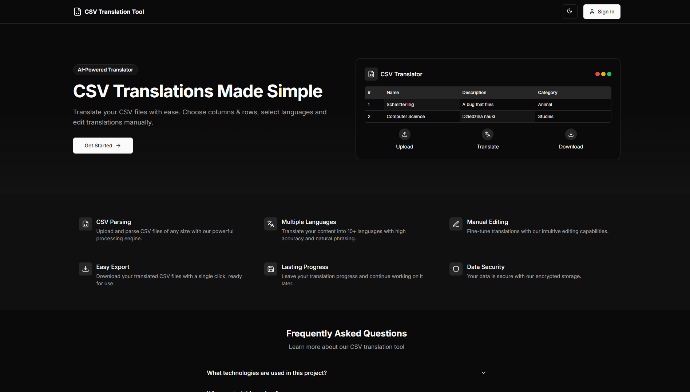
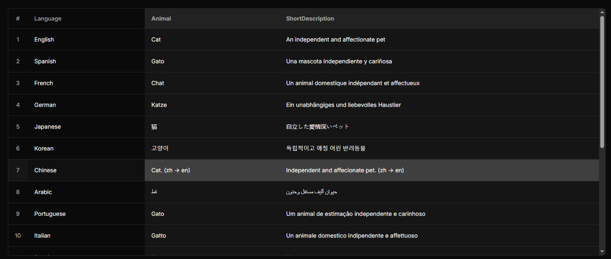

# CSV Translation Tool

🌍 **Web app** for semi-automatic CSV translation | **AI-assisted** (MarianMT) + **human validation**  

[](LICENSE)  
## Table of contents
  - [Features](#feature)
  - [Tech Stack](#tech_stack)
  - [Prerequisites](#prerequisites)
  - [Quick start](#quick_start)
  - [Linting and formating](#linting_formating)
  - [Documentation](#documentation) or just go [Here](https://kerciu.github.io/csv-translation-tool/)
  - [Testing](#testing)
  - [Screenshots](#screenshots)





<a name="feature"></a>
## Key Features  

| Feature | Description |  
|---------|-------------|  
| **📁 File Processing** | CSV upload, column/row selection, data validation |  
| **🤖 Smart Translation** | MarianMT (Rust-powered), error highlighting, Redis caching |  
| **🔒 User Auth** | JWT/OAuth2 login with session persistence (MongoDB) |  
| **🚀 Export** | Download translated files |  

<a name="tech_stack"></a>
## Tech Stack

<table>
  <tr>
    <td width="20%">
      <h3 align="center">Frontend</h3>
      <p align="center">
        
        
        
        <br>
        
        
      </p>
    </td>
    <td width="20%">
      <h3 align="center">Backend</h3>
      <p align="center">
        
        
        
        
      </p>
    </td>
    <td width="20%">
      <h3 align="center">AI/ML</h3>
      <p align="center">
        
        
        
        
      </p>
    </td>
    <td width="20%">
      <h3 align="center">Data</h3>
      <p align="center">
        
        
      </p>
    </td>
    <td width="20%">
      <h3 align="center">Infrastructure</h3>
      <p align="center">
        
        
        
      </p>
    </td>
  </tr>
</table>
<a name="prerequisites"></a>
## Prerequisites
  - [Python](https://www.python.org/downloads/) (<13v, 12v recommended)
  - [Docker](https://www.docker.com/) (latest stable version)
  - [Rust](https://www.rust-lang.org/tools/install) (latest stable version)
  - [Node.js](https://nodejs.org/) (v16+ recommended)
  - [npm](https://www.npmjs.com/) (comes with Node.js)

<a name="quick_start"></a>
## Quick Start

1. **Clone the repository**
   ```bash
   git clone https://gitlab-stud.elka.pw.edu.pl/kgorski1/zpr_25l
   cd zpr_25l

2. **Open installed docker's desktop application**

3. **Build docker**
   ```bash
    docker-compose build
   ```

4. **Run docker**
   ```bash
    docker-compose up
   ```
5. **Go to site**
   You can now go to http://localhost:3000 and enjoy our app.
   Try uploading from test_data catalog example.csv to test it yourself!


<a name="linting_formating"></a>
## Linting and formating
  - [pre-commit](https://pre-commit.com) for automatic coding style verification and formating
  - ***python***: flake8, black, isort
  - ***react***: ESlint, Prettier
  - ***rust***:  clippy, fmt
### To run
  #### Python-react
```bash
  pip install -r requirements-dev.txt
  pre-commit install
  pre-commit run --all-files
```
  #### Rust
```bash
  cd model
  cargo fmt
  cargo clippy
```
<a name="documentation"></a>
## Documentation 
### Python or just go [Here](https://kerciu.github.io/csv-translation-tool/)
- **REST API**: ***Swagger*** - you can see it by running the application and going to [here](http://127.0.0.1:8000/swagger/)
- **Models, Serializers, Utils**: ***docstrings + [Sphinx](https://www.sphinx-doc.org/en/master/)*** - to run:
    1. #### Install all dependencies
      pip install -r requirements-dev.txt
    2. #### Go to docs folder in server
      cd server
      cd docs
    3. #### Based on your system use make file
    **Linux**:
    ```bash
    make html
    ```

  
    **Windows:**
    ```bash
    .\make.bat html
    ```

    4. #### To see it open in your browser build/html/index.html or use this commend
    **Linux:**
    ```bash
    cd .\build\html\
    start index.html
    ```

  
    **Windows:**
    ```bash
    cd .\build\html\
    Start-Process index.html
    ```
<a name="testing"></a>
## Testing

### Python
1. **Run docker**
```bash
docker-compose up
```
2. **Start translator-model container's bash**
```bash
  docker exec -it translator-server bash
```
3. **Run tests**
```bash
  python manage.py test
```

### Rust
1. **Go to model folder**
```bash
cd model
```
2. **Run tests**
```bash
cargo test
```

## Screenshots



