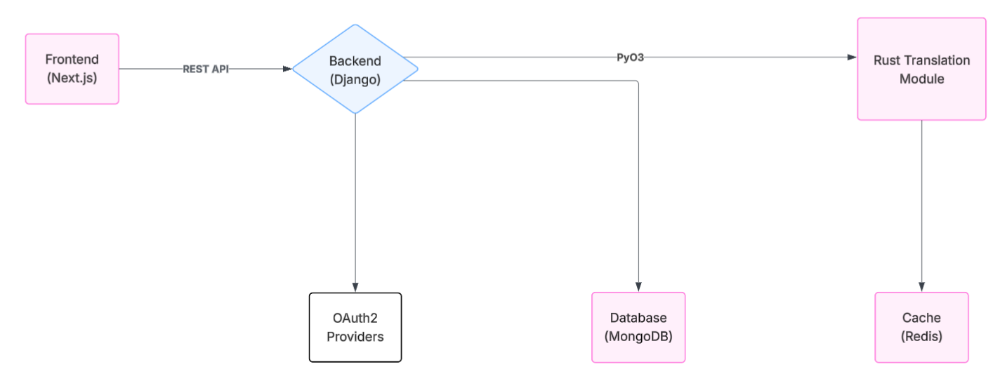

# Dokumentacja końcowa

## Dane statystyczne

### Liczba lini kodu - 10861
### Liczba testów - 87
### Procentowe pokrycie kodu testami - 96% (nie licząc frontendu)

## Architektura aplikacji

   
  <em>Architektura systemu tłumacza plików CSV</em>

## Schemat bazy danych

   
  <em>Schemat bazy danych używany jako wzór to implementacji w django</em>

## Spędzony czas

| **Zadanie** | **Czas (szac.)** | **Czas końcowo**|
|---|---|---|
| **Analiza i przygotowanie projektu** | **10h** | **10h**
| Wybór stosu technologicznego, plan funkcjonalności | 3h | 3h
| Dokumentacja, podział ról, repozytorium, plan pracy | 7h | 7h
| Wstępne zamodelowanie wyglądu dokumentowej bazy danych | 6h | 6h
| **Backend (Django + PyO3)** | **50h** | **72h**
| Autoryzacja (JWT + OAuth2), obsługa sesji | 6h | 10h
| Obsługa plików CSV i walidacja | 6h | 8h
| API REST: uploady, sesje, interfejs do edycji | 12h | 18h
| Integracja z Rust (PyO3) i komunikacja z modułem ML | 10h | 10h
| Integracja z MongoDB, zamodelowanie bazy | 6h | 16h
| Integracja z Redis, cache'owanie tłumaczeń (i być może modeli) | 6h | **X**
| Testy jednostkowe zaimplementowanie przy pomocy Django test cases | 10h | 14h
| **Moduł tłumaczący (Rust + MarianMT)** | **30h** | **46h** |
| Wczytywanie i optymalizacja modelu MarianMT | 8h | 20h |
| Mechanizm cache'owania + optymalizacje | 8h | 8h |
| Generowanie skryptów pozwalających na pracę z niekompatybilnymi modelami | 0h | 8h |
| Testy jednostkowe i testowanie manualne | 8h | 8h |
| Integracja z backendem poprzez wtyczke PyO3 | 8h | 2h | 
| **Frontend (React + Next.js + Tailwind)** | **80h** | **89h** |
| Strona główna oraz okna do uwierzytelniania użytkownika | 10h | 8h |
| System uploadu i parser CSV (z wyborem kolumn/wierszy) | 16h | 10h |
| Interfejs do edycji tłumaczeń (z shortcutami, walidacją) | 24h | 15h |
| Widok sesji, tłumaczeń, edycja w oknie dialogowym | 10h | 14h |
| Eksport wyników, statusy tłumaczeń, widok postępu | 10h | 8h |
| Autoryzacja, routing, dostęp do API | 16h | 16h |
| Stylowanie i UX (Tailwind + shadcn/ui), responsywność | 10h | 8h |
| Integracja z backendem | 10h | 10h |
| **DevOPS** | **4h** | **24h** |
| Skonteneryzowanie aplikacji za pomocą dockera | 4h | 16h |
| Ustawienie pipeline'ów CI/CD za pomocą Github Actions  | 2h | 8h |

**Łączny czas projektu zamierzony: 170h**
**Łączny czas projektu rzeczywisty: 241h**

## Napotkane problemy

1. **Frontend:**
Jeżeli chodzi o frontend to wiele problemów technicznych nie napotkaliśmy, ponieważ nasz frontend skupiał się silnie na UI i występowały po prostu problemy architektury artystycznej. Jako że członkowie zespołu są dobrze zaznajomieni z narzędziami tworzącymi frontend nie było wiele problemu z nimi. Wiekszym mankamentem było dostosowanie interfejsu użytkownika do wymagań.
2. **Model:**
Implementacja modelu MarianMT w Rust za pomocą biblioteki Candle niestety zabrała więcej czasu niż względnie oczekiwaliśmy. Ze względu na niedobór materiałów i ubogość dokumentacji (którą znaleźliśmy) zaimplementowaliśmy model po wielokrotnych męczeńskich próbach po prostu zdecydowaliśmy się na użycie kodu z oficjalnego przykładu biblioteki Candle. Wstępnie Redis miał być zaimplementowany w Pythonie, ale w trakcie tworzenia projektu straciło to sens, i został on zaimplementowany w Rust - wspominam o nim bo był znacznie trudniejszy od implementacji w Pythonie. Chyba największym wyzwaniem jeżeli chodzi o tą część projektu było przystosowanie modeli do działania wraz z biblioteką Candle. Na początku myśleliśmy że Candle oficjalnie obsługuje wszystkie modele HuggingFace, co jednak niestety okazało się nie prawdą. Receptą na tę trudność było napisanie skryptów w Pythonie, zainspirowanych internetem, stack overflow i innymi źródłami (nawet oficjalnym skryptem z tokenizatorami) które między innymi pobierały model z internetu, oczyszczały foldery użytkownika ze “śmieciowych” modeli oraz, co najważniejsze konwertowały modele z pytorch_model.bin do formatu model.safetensors poprzez zamianę wag. Gdy to się udało poszło z górki, dopóki nie zauważyliśmy, że każdą parę językową trzeba pobierać osobno model i nie ma pewności że jeżeli mamy tłumaczenie z polskiego na angielski to jest również tłumaczenie z angielskiego na polski. Rozwiązaniem problemu również było po prostu napisanie skryptu pobierającego wszystkie możliwe pary dla konkretnego języka i zapisanie go w formacie JSON a później odczytywanie i walidacje. Oceniam, że nauczyłem się bardzo dużo pisząc w Rust ten model i napotkałem wiele problemów na które możliwe że się nie napotkam w pracy informatyka, ale było to bardzo pouczające i ustawił mnie w szeregu jeżeli chodzi o dotknięcie skomplikowanej problematyki.
3. **Backend**:
Integracja MongoDB z django. Z jednej strony sam fakt użycia mongoDB oceniam pozytywnie, ale muszę przyznać, że jak chodzi o połączenie z django nie był aż tak trafny i można to traktować jako eksperymentalną próbę zapoznania się z tą bazą danych. Błędem był mały research co do zapoznania się jakie bazy danych współpracują z django jakie nie i niestety mongoDB do nich jak na razie nie należy. Głównym powodem wybrania go była możliwość przechowywania danych jako JSON, co ułatwia prace z nimi i przeszukiwanie a można by to równie dobrze zaimplementować przez np. mySQL i użycie w django models.JSONField(). Można by powiedziec, że za to mongoDB daje lepszy performance, ale po (właśnie zapomnianym) researchu i doczytaniu wychodzi na to, że i tego nie daję, ze względu na trudności z transakcjami, co na szczęście przy prostej bazie danych i małej ilości potencjalnych zmian nie wpłyneło na całość, ale przy bardziej rozwiniętej bazie i większej możliwości zmieniania jej mogłoby się nim stać, żeby dokonywać ich bezpiecznie i szybko. Wnioski: większy research co do współpracy różnych środowisk i łączenia ich.
4. **DevOps**:
Z Dockerem wszystko szło gładko, dopóki nie zaczęła się praca z modelem w Rust i kompilacją go do pliku .whl. Wtedy po prostu toczyliśmy batalię z ścieżkami systemowymi i tymi w kontenerze. Tak samo było ze skryptami. Staraliśmy się również zoptymalizować Dockera najlepiej jak mogliśmy, lecz jednak pobieranie ogromnej ilości ciężkich bibliotek takich jak Pytorch oraz sama kompilacja Rusta i tak zajmuje ogrom czasu, ale nie zajmuje też tyle miejsca ile pierwotnie zajmowało.
System ciągłej integracji (CI) pozwoliła nam na profesjonalne prowadzenie projektu, pracę na bieżąco z testami jednostkowymi, linterami i  formatterami - narzędziami które pozwalało nam na porządną pracę w repozytorium. Z nim był o tyle problem jak chodzi o ustawienie github secrets i głównie takie drobne rzeczy jak np. cargo clippy na komputerze wyświetla niektóre rzeczy jako ostrzeżenia a w CI/CD trzeba było specjalnie ustawiać flagę, żeby ich tak nie traktował, co nie nazwałbym problematycznym, ale uciążliwym. 

## Czego nie udało się zrealizować

Patrząć na dokumentację wstępną projektu, z dumą możemy stwierdzić że zaimplementowaliśmy praktycznie wszystko to co założyliśmy sobie na etapie planowania projektu. Jednyną rzeczą, której rzeczywiście nie zrobiliśmy to postawienie pipeline'ów CI na Gitlabie, ale jako, że projekt był migrowany na Githuba, a pipeline'y CI na Githubie (Github Actions) zostały pomyślnie postawione, krok ten można pominąć.

## Dlaczego projekt jest sukcesem

Projekt zasługuje na wysoką ocenę przez serce włożone przez nas w ten projekt, gdy usłyszeliśmy, że reszta grup wykonujących ten projekt nie zdała przedmiotu, postanowiliśmy, że my zmienimy tą złą passę i stworzymy coś naprawdę solidnego i kompetentego. Jesteśmy naprawdę dumni z tego, jak to wszystko razem wygląda, zbudowaliśmy projekt produkcyjny, który ma rzeczywistą wartość rynkową i robi efekt "wow". Myślę, że przez to i to, że udało zrealizować się wszytkie wstępne wymagania projekt zasługuje na wysoką ocenę.

## Wnioski i refleksje

Praca nad projektem była intensywnym, ale bardzo satysfakcjonującym procesem. Zespół zdobył doświadczenie w integracji różnych technologii, takich jak Django, Rust, React czy Docker, oraz zmierzył się z rzeczywistymi wyzwaniami inżynierii oprogramowania — od problemów z dokumentacją bibliotek po optymalizację pracy z dużymi modelami ML. Projekt pozwolił nam rozwinąć nie tylko kompetencje techniczne, ale też miękkie: zarządzanie czasem, podział obowiązków, komunikacja w zespole i podejmowanie decyzji projektowych pod presją. 

Jesteśmy dumni z efektu końcowego i przekonani, że ta aplikacja ma wartość nie tylko dydaktyczną, ale również rynkową.
